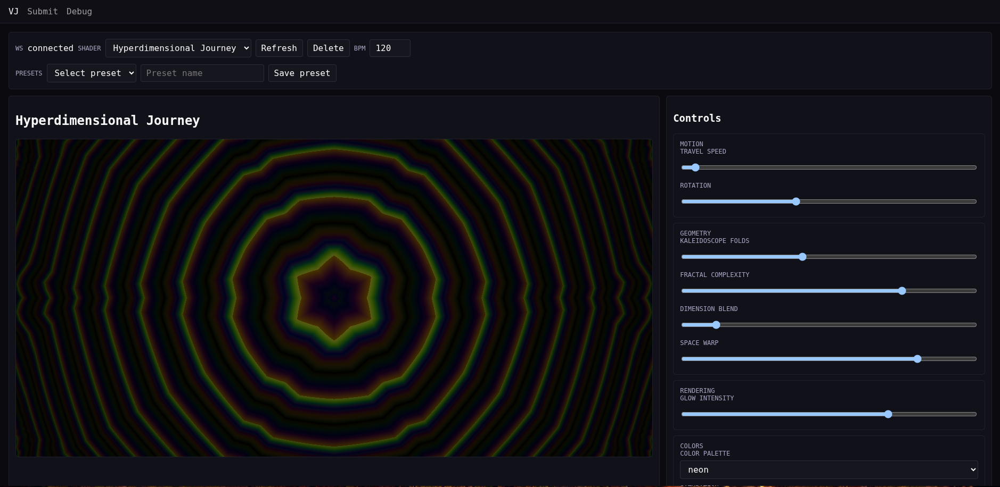

# sh8r



sh8r is a live VideoJockey tool for submitting and performing GLSL shaders.
The app exposes three primary views: Submit, VJ, and Live, plus a Debug view.
The VJ controls shader parameters in real time via WebSockets.

## Features

- Shader submission (JSON manifest or raw GLSL)
- Dynamic controls based on shader parameter metadata
- Realtime server-authoritative updates via WebSockets
- Preset save/load per shader
- BPM/beat/bar uniforms for timing sync
- Live fullscreen view + optional debug overlay

## Local development

### With Docker Compose

```bash
make setup-dev
make run-dev
```

Services run on:
- Frontend: `http://localhost:${SH8R_FRONTEND_DEV_PORT:-3000}`
- Backend API: `http://localhost:${SH8R_BACKEND_DEV_PORT:-3001}`
- WebSocket: `ws://localhost:${SH8R_BACKEND_DEV_PORT:-3001}/ws`

### Without Docker

```bash
cd backend && npm install && npm run dev
cd ../frontend && npm install && npm run dev
```

## Environment variables (host-level)

All variables are prefixed with `SH8R_` when supplied by the host.

- `SH8R_API_URL` - Frontend API URL (prod build)
- `SH8R_WS_URL` - Frontend WS URL (prod build)
- `SH8R_FRONTEND_PORT` - Frontend prod port (default: 8080)
- `SH8R_FRONTEND_DEV_PORT` - Frontend dev port (default: 3000)
- `SH8R_BACKEND_PORT` - Backend prod port (default: 3001)
- `SH8R_BACKEND_DEV_PORT` - Backend dev port (default: 3001)
- `SH8R_DATABASE_URL` - Backend database URL
- `SH8R_POSTGRES_USER` - Local postgres user (dev profile)
- `SH8R_POSTGRES_PASSWORD` - Local postgres password (dev profile)
- `SH8R_POSTGRES_DB` - Local postgres database (dev profile)
- `SH8R_POSTGRES_PORT` - Local postgres port (dev profile)
- `SH8R_ENVIRONMENT` - Runtime environment label
- `SH8R_LOG_LEVEL` - Backend log level
- `SH8R_DOCKER_NETWORK_NAME` - Docker network name

## Layout

```
backend/   Fastify + WebSocket API
frontend/  React + Vite frontend
```
